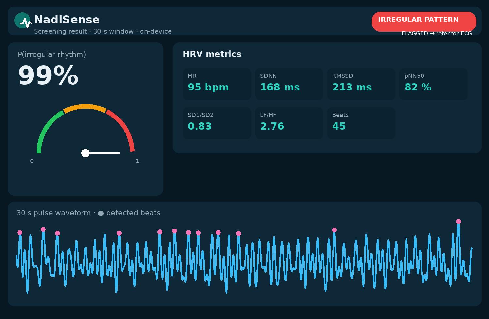

# NadiSense 🫀 — 60-Second AI Heart-Rhythm Screening for Rural India

**TECHNOVA 2026 · National AI Innovation Challenge · TSM Madurai**
Team **Matric Phase** — Aditya Mehra (E&TC) · Abhishek Singh (E&TC) · Siddesh Wagh (BCA)

> **Camera-only photoplethysmography · 6 KB on-device neural network · zero hardware · zero internet · EN / हिं / தமிழ்**



## 🎬 Demo (89 s — everything below is the real app)

<video src="demo.mp4" controls width="100%"></video>

*Full walkthrough: onboarding → AFib-style capture (live HR 95) → red-flag result (P(irr) 100%) → normal sinus capture (HR 72) → green result (P(irr) 0%) → motion guardrail → Hindi UI → on-device report.*

## ▶ Try it live (no install — GitHub Pages)

**https://aa7304-meh.github.io/Nadisense/** — open on a phone or laptop, tap **Demo Mode**, pick *Atrial fibrillation-like* or *Normal sinus rhythm*, and watch the full 60-second screening → HRV analysis → risk flag → report run in your browser. Camera capture also works on any phone with HTTPS.

---


## What it does

Cardiovascular disease is India's #1 killer, and the stroke-causing rhythm disorder **atrial fibrillation (AFib)** is silent — its first symptom is often the stroke itself. The only reliable test is an **ECG**, but ECG machines live in district hospitals 40–90 km away from rural patients.

**NadiSense turns any smartphone camera into a pulse monitor.** An ASHA worker places the patient's fingertip on the lens for 60 seconds; the app reads the pulse waveform (reflectance PPG), extracts 12 heart-rate-variability (HRV) features, and runs a **6 KB neural network entirely on the phone** to flag irregular rhythm — then gives one clear action: 🟢 routine · 🟡 repeat in 2 weeks · 🔴 ECG within 7 days.

No sensor. No cloud. No clinic visit. ₹0 hardware.

## ▶ Run it

The app is dependency-free and works straight from the folder:

```bash
# Option A — just open it
open index.html

# Option B — serve it (needed for camera access)
python3 -m http.server 8000
# → http://localhost:8000
```

**Demo Mode** (on the home screen) feeds simulated pulse signals through the *exact same* DSP + classifier as camera capture — perfect for presentations: try *Atrial fibrillation-like* → red flag at ~100%, then *Normal sinus rhythm* → green at ~0%.

## 🧠 How it works

```
fingertip on camera (green-channel ROI, ~30 Hz)
   → detrend + zero-phase FFT band-pass (0.6–3.5 Hz)
   → adaptive 2-pass peak (systolic) detection
   → 12 HRV / irregularity features
   → ±3σ winsorise → MLP 12→20→10→1 (6 KB, ~2 ms)
   → P(irregular rhythm) → care level + printable report
```

| | |
|---|---|
| **Features (12)** | HR, SDNN, RMSSD, pNN50, SD1, SD2, SD1/SD2, LF/HF, spectral entropy, turning-point ratio, irregularity %, ectopy-like beat fraction |
| **Model** | MLP 12→20→10→1 (tanh/tanh/sigmoid) — **6 KB**, ~2 ms inference, plain-text weights |
| **Training** | `tools/train_mlp.py` — 12,000 windows of physiologically modelled PPG + augmentation; NumPy reference mirrors the JS DSP 1:1 (cross-language corr ≈ 0.998) |
| **Held-out** | ~99.5% acc · 99.6% sens · 99.4% spec (synthetic distribution) |
| **Guardrails** | quality < 0.6 → retake · HR 40–180 · ≥ 12 clean beats · ectopy note |

## ✅ Tests (all reproducible)

```bash
node tests/run_tests.mjs           # 30 assertions (no dependencies) — simulator, DSP, features, classifier, guardrails
npm i jsdom && node tests/run_browser_smoke.mjs   # 13 assertions driving the real UI end-to-end
```

## 🔒 Privacy by architecture

Frames are summed to ONE green-channel mean inside the app and discarded. There is **no server** — nothing is stored, uploaded or shared. The screening report is generated on-device.

## ⚠️ Honest limitations (we disclose, we don't hide)

- The shipped model is validated on a realistic **synthetic** training distribution; a **real-patient benchmark (MIT-BIH AF/NSR)** is one command away:
  ```bash
  pip install wfdb scipy && python tools/train_mlp.py --real-data
  ```
- This is a **screening aid, not a medical device** — it never says "you have AFib", it says "get an ECG within 7 days".

## 🗂 Repo layout

```
index.html, css/          UI (single-page, no build step)
js/dsp.js                 DSP kernel — FFT band-pass, peak detection, 12 HRV features
js/classifier.js          winsorise → forward pass → care levels
js/model_weights.js       auto-generated by tools/train_mlp.py
js/ppgcamera.js           camera PPG capture
js/simulator.js           6-scenario synthetic test fixture
js/i18n.js / asr.js       EN·हिं·தமிழ் UI + voice questionnaire
tools/                    train_mlp.py · build_standalone.mjs · render_pdfs.py · make_figures.py
tests/                    run_tests.mjs · run_browser_smoke.mjs
assets/                   figures & UI mock (generated from the product's own pipeline)
```

## 🗺 Roadmap

| Milestone | When | What |
|---|---|---|
| v0.9 (this repo) | Sept 2026 | Working prototype, tested, documented |
| v1.0 | Q4 2026 | MIT-BIH retrain + validation report · PHC pilot (Madurai region) |
| v1.1 | H1 2027 | Multi-class rhythm model · follow-up scheduler · report handoff |
| v2.0 | 2027+ | ASHA-assistant: screening calendar, BP/diabetes trends, ANM integration |

---

**Team Matric Phase · TECHNOVA 2026** · Thiagarajar School of Management, Madurai
*Prototype — not a medical device. Demo needs no camera (Demo Mode) and no internet.*
